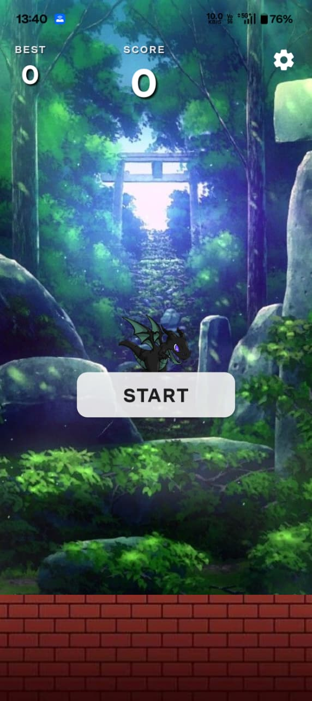
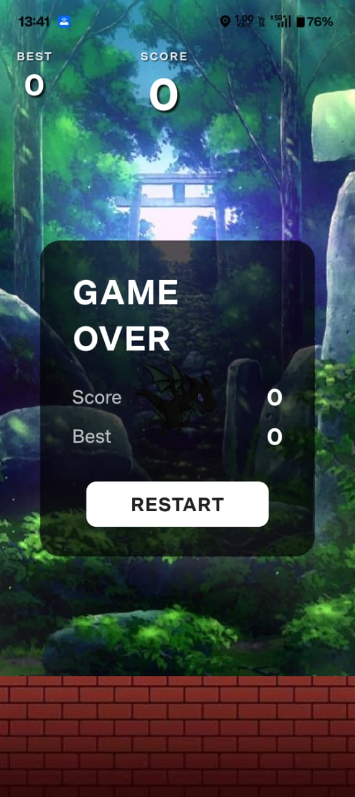
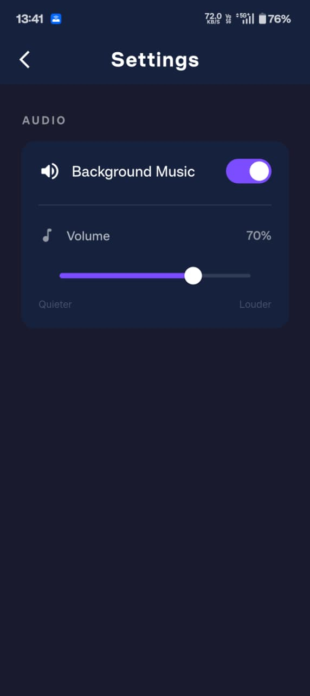

#  Pixi Dragon

A Flappy Bird-style arcade game for Android built with Flutter. Control a dragon flying through pipe gaps, beat your high score, and survive as long as you can.

---

## Screenshots

<p float="left">
  
  
  
  
</p>
---

## Features

-  Dragon character with gravity-based physics
-  Randomised pipe gaps — no fixed pattern
-  Best score saved permanently on device
-  Looping background music with volume control and mute toggle
- ️ Settings screen accessible from home screen
-  Difficulty increases at score 10
-  All data stored locally — no internet required
-  One-tap controls
-  Screen-specific security — Android `FLAG_SECURE` prevents capturing/recording sensitive screens (Login, Leaderboard, Settings/Profile)

---

## Gameplay

- Tap the screen to make the dragon flap upward
- Gravity pulls the dragon down continuously
- Fly through the gap between each pipe pair to score a point
- Game ends if the dragon hits a pipe, the ground, or the ceiling
- Your best score is saved automatically and shown at all times

---

## Tech Stack

| Layer | Technology |
|---|---|
| Framework | Flutter (Dart) |
| State Management | Provider |
| Local Storage | shared_preferences |
| Audio | audioplayers |
| Backend | None — fully offline |

---

## Project Structure

```
lib/
 ├── constants/
 │    └── app_assets.dart         — asset path constants
 ├── providers/
 │    └── game_provider.dart      — game loop, physics, collision, scoring
 ├── screens/
 │    ├── splash_screen.dart      — launch screen with fade transition
 │    ├── game_screen.dart        — main game UI and state rendering
 │    └── settings_screen.dart    — audio settings
 ├── services/
 │    ├── audio_service.dart      — music playback, volume, persistence
 │    └── security_service.dart   — dynamic FLAG_SECURE window controller
 ├── widgets/
 │    ├── dragon.dart             — dragon sprite widget
 │    ├── pipe.dart               — pipe pair widget
 │    └── score_bar.dart          — score display widget
 └── main.dart                   — entry point, provider setup

assets/
 ├── images/
 │    ├── background/forest_bg.png
 │    ├── bird/flappy_dragon.png
 │    ├── ground/brick_wall.png
 │    └── obstacles/obstacle.png
 └── audio/
      └── liberation.mpeg
```

---

## Getting Started

### Prerequisites

- [Flutter SDK](https://flutter.dev/docs/get-started/install) (Dart SDK >=3.0.0)
- Android Studio or VS Code with Flutter extension
- Android device or emulator (API level 21+)

### Installation

**1. Clone the repository**
```bash
git clone https://github.com/Shreyashkhandar/pixi_dragon.git
cd pixi_dragon
```

**2. Install dependencies**
```bash
flutter pub get
```

**3. Run the app**
```bash
flutter run
```

### Build APK

```bash
flutter build apk --release
```

The APK will be at:
```
build/app/outputs/flutter-apk/app-release.apk
```

---

## Dependencies

```yaml
dependencies:
  provider: ^6.1.2
  audioplayers: ^6.0.0
  shared_preferences: ^2.3.2
```

---

## How It Works

### Physics
The dragon uses Euler integration with a fixed gravity constant and an instant velocity replacement on tap (flap). A 16ms timer drives the game loop — approximately 60 frames per second.

### Collision System
All collision detection runs in a normalized `-1.0 to +1.0` coordinate space to remain consistent across all screen sizes. The dragon's hitbox uses only the visible body pixels (not the full image bounds) to ensure collisions feel fair and accurate.

### Scoring
A point is awarded when a pipe's right edge crosses the dragon's horizontal centre. Best score is written to device storage the instant a new record is set.

### Audio
Background music starts when the game screen mounts (after the splash screen) and stops when the app closes. Volume and mute state persist across app restarts.

### Security (FLAG_SECURE)
Sensitive screens (Login, Leaderboard, Settings/Profile) are protected using Android's native `FLAG_SECURE` window setting. A custom Flutter `MethodChannel` communicates with the native Android Kotlin code in `MainActivity.kt` to dynamically enable the secure flag when entering these screens and disable it upon exit (using reference counting to manage overlapping route states). This prevents the device from taking screenshots, screen recordings, or showing preview snapshots in the recent-app switcher for those pages, while keeping the main gameplay screens free for sharing high scores.

---

## Game Constants (Tuning)

All gameplay feel is controlled by constants in `lib/providers/game_provider.dart`:

| Constant | Value | Description |
|---|---|---|
| `gapHalfHeight` | `0.32` | Half the pipe gap size |
| `_gravity` | `3.8` | Downward pull per second |
| `_jumpVelocity` | `-1.4` | Upward force on tap |
| `_basePipeSpeed` | `0.9` | Pipe speed before score 10 |
| `_fastPipeSpeed` | `1.4` | Pipe speed after score 10 |
| `_dragonBodyFraction` | `0.45` | Dragon hitbox as fraction of image |
| `_pipeBodyFraction` | `0.65` | Pipe hitbox as fraction of image |

---

## Screens

| Screen | Description |
|---|---|
| Splash | Dragon + "ASK" text, fades into game screen after 2.4 seconds |
| Game (Ready) | Home screen with START button and settings icon |
| Game (Playing) | Active gameplay with score display |
| Game (Over) | Score summary with RESTART button |
| Settings | Volume slider and music on/off toggle |

---

## Local Data Storage

Data is stored using `shared_preferences` on the Android device. No data leaves the device.

| Key | Type | Description |
|---|---|---|
| `pixi_dragon_best_score` | int | All-time best score |
| `pixi_dragon_volume` | double | Last set volume (0.0 – 1.0) |
| `pixi_dragon_muted` | bool | Last mute state |

---

## Platform Support

| Platform | Supported |
|---|---|
| Android | ✅ |
| iOS | ❌ |
| Web | ❌ |
| Desktop | ❌ |

---

## Documentation

Full technical documentation is available in [`DOCUMENTATION.md`](DOCUMENTATION.md).

Project requirements are listed in [`requirements.txt`](requirements.txt).

---

## License

This project is for personal and educational use.

---

*Built with Flutter by ASK*